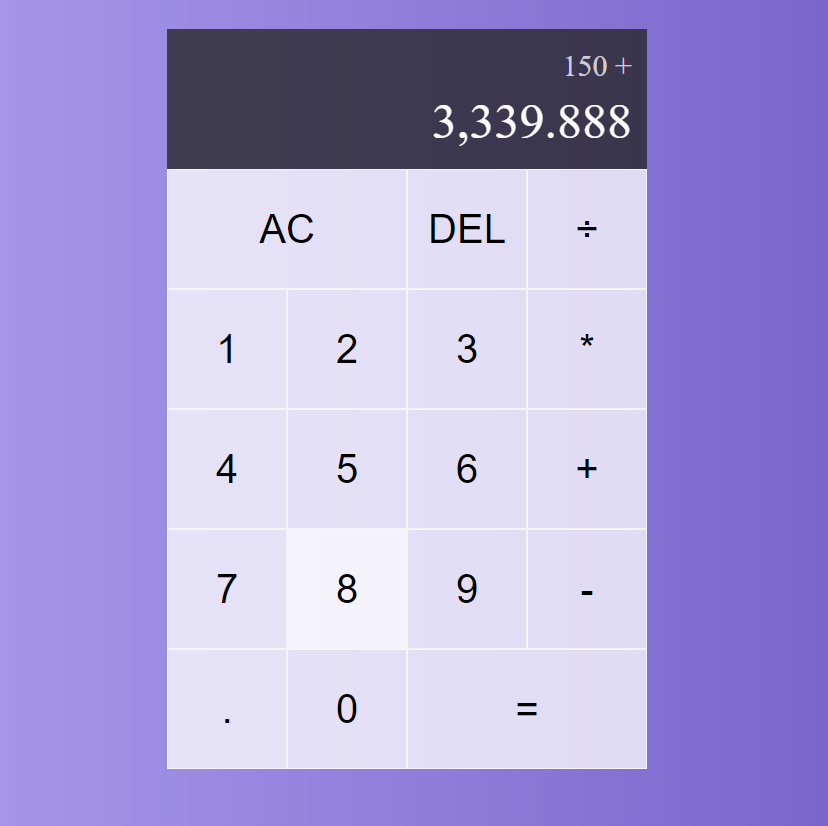

# Calculator-React
A calculator made with React JS

### Screenshot

### Links

- See what the calculator looks like and use it [here](https://calculator-react-xi-five.vercel.app/)

## My process

### Built with

- Semantic HTML5 markup
- CSS custom properties
- JSX
- useState
- useReducer

### What I learned

This was my first time using the useReducer hook. I learnt how it can be used to make your code cleaner and make your work easier.
